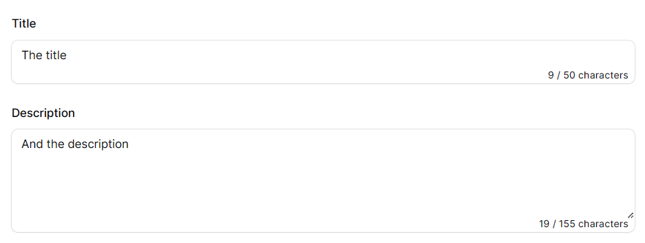

# Filament Character Counter

[](https://packagist.org/packages/schmeits/filament-character-counter)
[](https://github.com/schmeits/filament-character-counter/actions?query=workflow%3Arun-tests+branch%3Amain)
[](https://github.com/schmeits/filament-character-counter/actions?query=workflow%3A"Fix+PHP+code+styling"+branch%3Amain)
[](https://packagist.org/packages/schmeits/filament-character-counter)

This is a filament character counter TextField and Textarea form field.



## Installation

You can install the package via composer:

```bash
composer require schmeits/filament-character-counter
```

You can publish the translations file with:

```bash
php artisan vendor:publish --tag="filament-character-counter-translations"
```

This is the contents of the published translation file:

```php
return [
    'character_seperator' => ' / ',
    'character_label' => 'characters',
];
```

## Usage

```php
use Schmeits\FilamentCharacterCounter\Forms\Components\TextInput;
use Schmeits\FilamentCharacterCounter\Forms\Components\Textarea;

TextInput::make('title')
    ->characterLimit(50),

Textarea::make('description')
    ->characterLimit(155),
```

## Testing

```bash
composer test
```

## Changelog

Please see [CHANGELOG](CHANGELOG.md) for more information on what has changed recently.

## Contributing

Please see [CONTRIBUTING](.github/CONTRIBUTING.md) for details.

## Security Vulnerabilities

Please review [our security policy](../../security/policy) on how to report security vulnerabilities.

## Credits

- [Tally Schmeits](https://github.com/schmeits)
- [All Contributors](../../contributors)

## License

The MIT License (MIT). Please see [License File](LICENSE.md) for more information.
